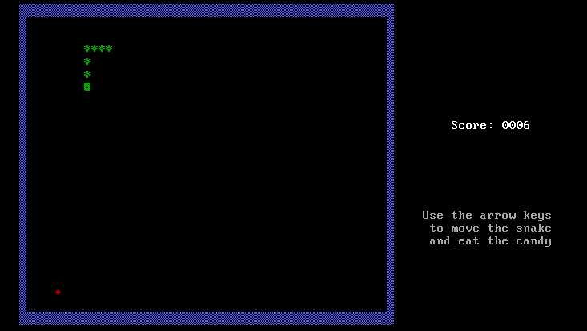

# Snake in an OS

This is an Operating System that boots up and starts a game of Snake. 

(One could also say that it is not really an operating system (if OS is defined as an environment to run other programs in)  but rather a Snake game that runs **without** an operating system on bare metal.)



## Compilation

To be able to compile this OS and run it using the Makefile included here you need to create an `i686-elf` cross compiler.

See [this](https://wiki.osdev.org/GCC_Cross-Compiler) article from the osdev.org Wiki on how to compile `binutils` and `gcc` for `i686-elf`.

In addition to that `nasm` needs to be installed (just use the standard package from your distribution package manager).

## Run it

### In QEMU

Just use the Makefile:

```
$ make boot
```

### On real hardware

Create the image `boot.img` with:

```
$ make boot.img
```

Find out what device your USB is (something like `/dev/sdX` where `X` stands for any letter).

Then write `boot.img` to the USB with

```
# dd if=boot.img of=/dev/sdX
```

Now you can boot from the USB by just putting it to the beginning of the boot order in your BIOS.

----

This has successfully been tested on an "Acer Aspire V 13".
